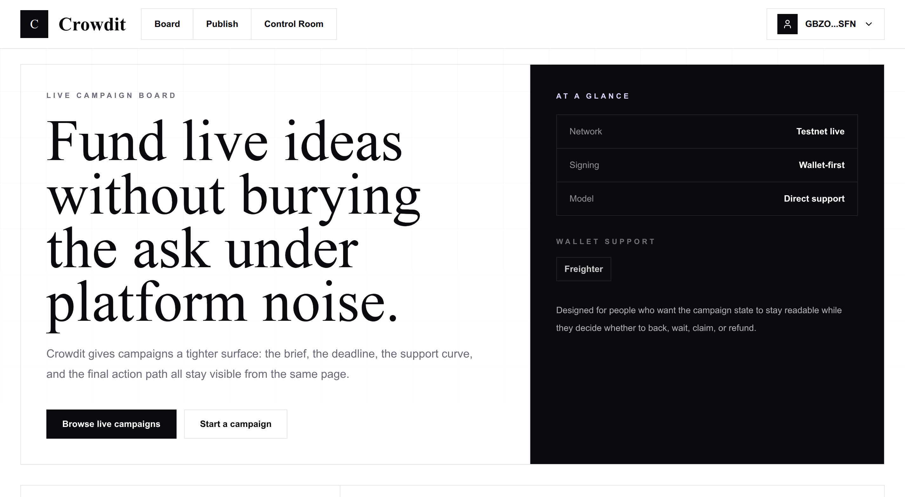

# Crowdit

Crowdit is a crowdfunding app on Stellar that treats campaigns like live operating notes instead of storefront tiles. Creators can publish asks with goals and deadlines, supporters can back them with XLM, and the Soroban contract handles the claim and refund paths after a campaign closes.

## Contents

- [What ships today](#what-ships-today)
- [Live links](#live-links)
- [Live testnet contracts](#live-testnet-contracts)
- [Screenshots](#screenshots)
- [Feature map](#feature-map)
- [Stack](#stack)
- [Project layout](#project-layout)
- [Reward token model](#reward-token-model)
- [Automation and delivery](#automation-and-delivery)
- [Verification status](#verification-status)
- [Local setup](#local-setup)
- [Contract workflow](#contract-workflow)


## What ships today

- Campaign creation with title, story, funding goal, and deadline
- Campaign browsing with filtering, sorting, progress tracking, and status grouping
- Campaign detail views with live backing, claim, and refund actions
- Inter-contract `CRD` reward minting on successful backing
- Real-time event-driven UI refresh patterns layered with React Query polling
- Mobile-friendly navigation and wallet flows
- GitHub Actions automation for build, test, and deploy work
- Freighter wallet connection and transaction signing
- Cached campaign and balance reads
- Toast feedback for pending, success, and failed transactions
- Creator dashboard with account-specific campaign activity
- Live Soroban deployment and production-style contract wiring

## Live links

- Live website: [https://project-cmtxw.vercel.app/](https://project-cmtxw.vercel.app/)
- Demo video: [Watch demo](snapshots/Crowdit-demo.mp4)

## Live testnet contracts

- Crowdit contract:
  [CDYGGIEGRZKKCKTAZ6SWE77SSCYAL6CPBQ5BDR74NCXYGSEQULD5GFYG](https://stellar.expert/explorer/testnet/contract/CDYGGIEGRZKKCKTAZ6SWE77SSCYAL6CPBQ5BDR74NCXYGSEQULD5GFYG)
- Crowdit deploy transaction:
  [a3066535d3f1a913dc9b099b07e010ea891420939dbb0d671bea3aa06c88e629](https://stellar.expert/explorer/testnet/tx/a3066535d3f1a913dc9b099b07e010ea891420939dbb0d671bea3aa06c88e629)
- Reward token contract:
  [CBLZZZAV7T7FWNJX3WDRYLPEJUIAKMDIMBUV5ZIEPOC4I72PSOP6N4MB](https://stellar.expert/explorer/testnet/contract/CBLZZZAV7T7FWNJX3WDRYLPEJUIAKMDIMBUV5ZIEPOC4I72PSOP6N4MB)
- Reward token deploy transaction:
  [df768b4c7452d40eeecbb97531ee7a543b3ab3df2e9d9919960b4e6b75e377cf](https://stellar.expert/explorer/testnet/tx/df768b4c7452d40eeecbb97531ee7a543b3ab3df2e9d9919960b4e6b75e377cf)
- Reward token metadata:
  `Crowdit Reward (CRD)`
- Inter-contract backing path:
  verified on the live testnet wiring, with the crowdfund contract linked to the deployed reward token contract during `back_campaign`

## Screenshots

### Desktop views

<table>
  <tr>
    <td align="center" width="50%">
      <strong>Home Page</strong><br />
      
    </td>
    <td align="center" width="50%">
      <strong>Campaign Listing</strong><br />
      
    </td>
  </tr>
  <tr>
    <td align="center" width="50%">
      <strong>Detailed Campaign Page</strong><br />
      
    </td>
    <td align="center" width="50%">
      <strong>Dashboard</strong><br />
      
    </td>
  </tr>
  <tr>
    <td align="center" width="50%">
      <strong>Create Campaign</strong><br />
      
    </td>
    <td align="center" width="50%"></td>
  </tr>
</table>

### Mobile views

<table>
  <tr>
    <td align="center" width="50%">
      <strong>Mobile Home</strong><br />
      
    </td>
    <td align="center" width="50%">
      <strong>Mobile Dashboard</strong><br />
      
    </td>
  </tr>
</table>

### Others

<table>
  <tr>
    <td align="center" width="50%">
      <strong>Test Cases Passing</strong><br />
      
    </td>
    <td align="center" width="50%">
      <strong>CI/CD</strong><br />
      
    </td>
  </tr>
</table>

## Feature map

### Core product

- Home page centered on product framing and featured campaigns
- Campaign listing page with active campaigns prioritized above ended ones
- Campaign detail page with recent backers, contribution flow, and settlement actions
- Creator dashboard with created campaigns, backed campaigns, claim queue, and refund queue
- Create campaign page with preview and draft persistence

### Wallet and transaction flow

- Freighter wallet connect and disconnect support
- Signed Soroban transactions for:
  - `create_campaign`
  - `back_campaign`
  - `claim_funds`
  - `refund`
- Transaction hash feedback with Stellar Expert links
- Friendly toast errors for cancellation, missing wallet, and submission failures

### Contract-backed data

- Campaign list loaded from live contract storage
- Individual campaign details loaded from the deployed contract
- Backer counts and recent contribution data loaded from contract reads
- Polling-based refresh through React Query
- Reward token balances loaded from the deployed `CRD` token contract

## Stack

### Frontend

- Next.js `16.2.4`
- React `19.2.5`
- TypeScript `6.0.3`
- Tailwind CSS `4.2.4`
- `@tanstack/react-query`
- `@stellar/stellar-sdk`
- `@stellar/freighter-api`
- `sonner`
- `lucide-react`

### Smart contracts

- Rust
- `soroban-sdk`
- Crowdfund contract
- Reward token contract

### Testing

- Vitest
- Testing Library
- Soroban contract unit tests

## Project layout

```text
.
├── contracts/
│   ├── crowdfund/
│   │   ├── src/
│   │   └── Cargo.toml
│   ├── reward-token/
│   │   ├── src/
│   │   └── Cargo.toml
│   └── README.md
├── src/
│   ├── app/
│   ├── components/
│   ├── hooks/
│   ├── lib/
│   ├── tests/
│   └── types/
├── .env.example
├── package.json
└── README.md
```

## Reward token model

Every successful backing can mint a reward balance from the separate reward token contract. In the current deployment, the token metadata is:

- Name: `Crowdit Reward`
- Symbol: `CRD`

This keeps the incentive path isolated from the main crowdfunding storage contract while still allowing live inter-contract behavior during support flows.

## Automation and delivery

Crowdit uses three GitHub Actions workflows:

- `Release Readiness` -> `.github/workflows/ci-cd.yml`
- `Verification Matrix` -> `.github/workflows/tests.yml`
- `Production Ship` -> `.github/workflows/deploy.yml`

### Workflow responsibilities

1. `Release Readiness`
   - installs dependencies
   - validates TypeScript
   - creates the production Next.js build
2. `Verification Matrix`
   - runs the frontend Vitest suite
   - runs crowdfund contract tests
   - runs reward token contract tests
3. `Production Ship`
   - syncs Vercel project settings
   - runs `vercel build`
   - runs `vercel deploy --prebuilt`

### Trigger behavior

- `Release Readiness`: push to `main` and `develop`, pull requests to `main` and `develop`, manual dispatch
- `Verification Matrix`: push to `main` and `develop`, pull requests to `main` and `develop`, manual dispatch
- `Production Ship`: manual dispatch or automatic run after `Release Readiness` succeeds on `main`

### Required GitHub secrets

- `CONTRACT_ID`
- `REWARD_TOKEN_ID`
- `VERCEL_TOKEN`
- `VERCEL_ORG_ID`
- `VERCEL_PROJECT_ID`

## Verification status

Verified locally:

```bash
$ pnpm test

Test Files  3 passed (3)
Tests       3 passed (3)
```

Covered flows:

- Wallet connect and disconnect flow
- Campaign data fetching
- Backing transaction mutation flow
- Crowdfund contract logic and reward-token mint integration

Additional verified commands:

```bash
pnpm exec tsc --noEmit
pnpm build
cargo test --manifest-path contracts/crowdfund/Cargo.toml
cargo test --manifest-path contracts/reward-token/Cargo.toml
```

## Local setup

### Prerequisites

- Node.js `18+`
- `pnpm`
- Rust toolchain
- `wasm32v1-none` target
- Freighter browser extension

### Install dependencies

```bash
pnpm install
```

### Vercel setup

1. Open the Vercel dashboard and create or import the project.
2. Open `Project Settings -> General`.
3. Copy:
   - `Project ID` into `VERCEL_PROJECT_ID`
   - `Team ID` or account identifier into `VERCEL_ORG_ID`
4. Open `Vercel Dashboard -> Settings -> Tokens`.
5. Create a token and store it as `VERCEL_TOKEN`.
6. Add the required GitHub Actions secrets listed above.
7. Set the same environment variables in the Vercel project dashboard for production deployments.

### Environment variables

Copy `.env.example` to `.env.local`:

```bash
NEXT_PUBLIC_NETWORK=testnet
NEXT_PUBLIC_CONTRACT_ID=CDYGGIEGRZKKCKTAZ6SWE77SSCYAL6CPBQ5BDR74NCXYGSEQULD5GFYG
NEXT_PUBLIC_REWARD_TOKEN_ID=CBLZZZAV7T7FWNJX3WDRYLPEJUIAKMDIMBUV5ZIEPOC4I72PSOP6N4MB
NEXT_PUBLIC_SOROBAN_RPC_URL=https://soroban-testnet.stellar.org
NEXT_PUBLIC_HORIZON_URL=https://horizon-testnet.stellar.org
NEXT_PUBLIC_STELLAR_EXPERT_URL=https://stellar.expert/explorer/testnet
```

### Run the app

```bash
pnpm dev
```

### Run frontend tests

```bash
pnpm test
```

### Type check

```bash
pnpm exec tsc --noEmit
```

## Contract workflow

### Run contract tests

```bash
pnpm contract:test
pnpm contract:test:reward
```

### Build the contracts

```bash
pnpm contract:build
pnpm contract:build:reward
```

### Manual deploy command for the crowdfund contract

```bash
stellar contract deploy \
  --wasm target/wasm32v1-none/release/crowdit_crowdfund.wasm \
  --source-account earnify-admin \
  --network testnet \
  --alias crowdit-testnet-20260430
```

### Manual deploy command for the reward token

```bash
stellar contract deploy \
  --wasm target/wasm32v1-none/release/reward_token.wasm \
  --source-account earnify-admin \
  --network testnet \
  --alias crowdit-reward-20260430
```

### Inter-contract verification

The live deployment was validated with the crowdfund contract wired to the reward token contract so `back_campaign` can mint reward balances through the separate `CRD` token contract.

This verifies both event families in the deployed system:

- `campaign_backed` from the crowdfund contract
- `reward_minted` from the reward token contract
